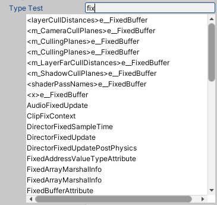

## Serializable Type - Unity Package for Type Serialization

This Unity package provides functionalities for serializing and deserializing `System.Type` objects during development. It includes two classes:

* **SerializableSystemType:** Facilitates `System.Type` object serialization by converting them to strings during serialization and back to types during deserialization.
* **SystemTypePropertyDrawer (Editor Only):** A custom property drawer allowing selection and editing of `SerializableSystemType` objects in the Unity Inspector.

### Installation

Install this package in your Unity project using the Package Manager:

1. Open the Package Manager window (**Packages** > **Manage Packages**).
2. Click on the **+** button in the top left corner and select **Add package from git URL**.
3. Paste the following URL into the address field and click **Install**: https://github.com/glurth/SerializableType.git

**Note:** This package utilizes reflection for type discovery. This might have a slight performance impact, especially in large projects.


### Usage

**SerializableSystemType:**


1. Include `SerializableSystemType.cs` in your project (automatically done during installation).

2. Use `SerializableSystemType` to store and retrieve `System.Type` objects during serialization/deserialization.


**Example:**


```C#

public class MyMonoBehaviour : MonoBehaviour

{
  
	[SerializeField]
  
	private SerializableSystemType myType;

  
	// ...

  
	private void Start()
  
	{
    
		if (myType.type != null)

		{
      
			// Use the deserialized type here
    
		}
	}

}
```

### Editor
Contains a property drawer that allow users to select a type from a filterable drop down list of all types.


### Contributions

Contributions, issues, and feature requests are welcome! Please submit them via the GitHub repository. Note: Due to licensing, contributions can only be included with explicit written permission from the copyright holder.

## License

This package is licensed under the EyE Dual-Licensing Agreement.

It provides free, perpetual use for indie developers and non-commercial projects whose teams had Total Gross Receipts under $100,000 USD in the previous fiscal year.

Organizations exceeding this threshold must obtain a Perpetual Commercial License (PCL) for each named commercial project.

Please review the full terms in [LICENSE.md](LICENSE.md) before commercial use.